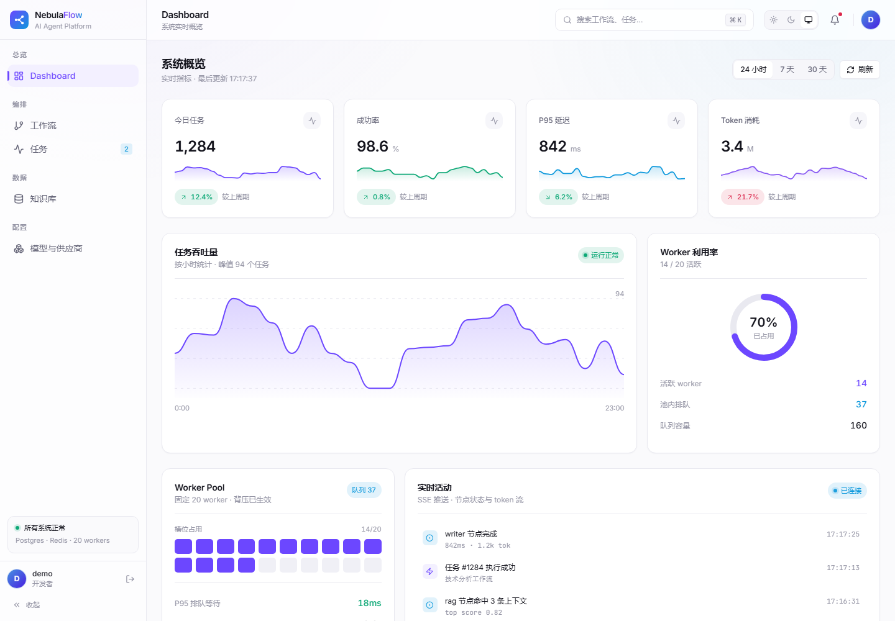
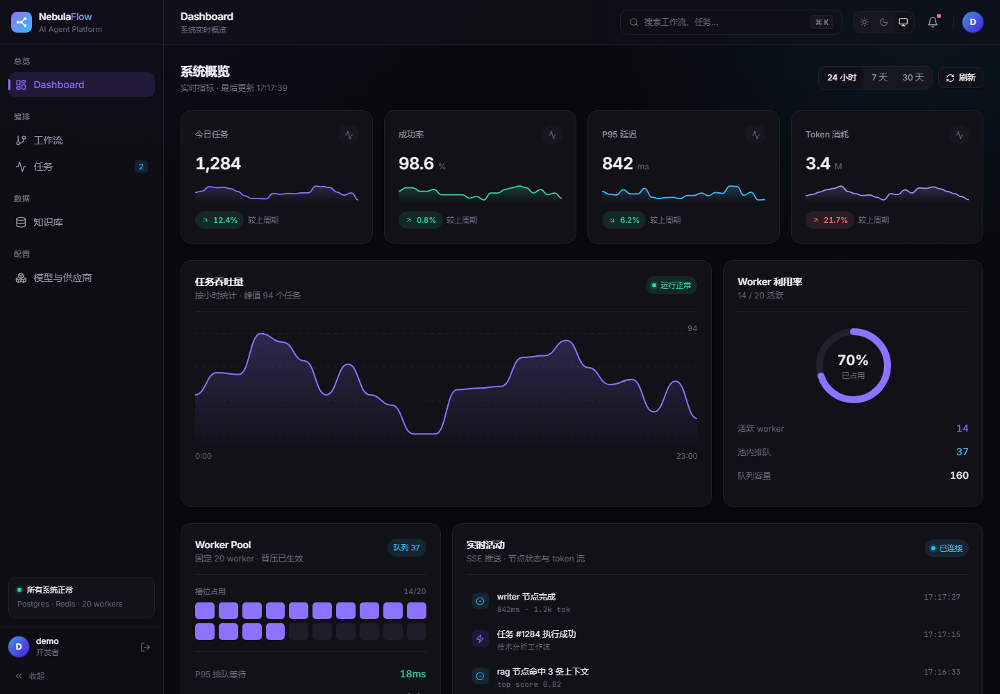
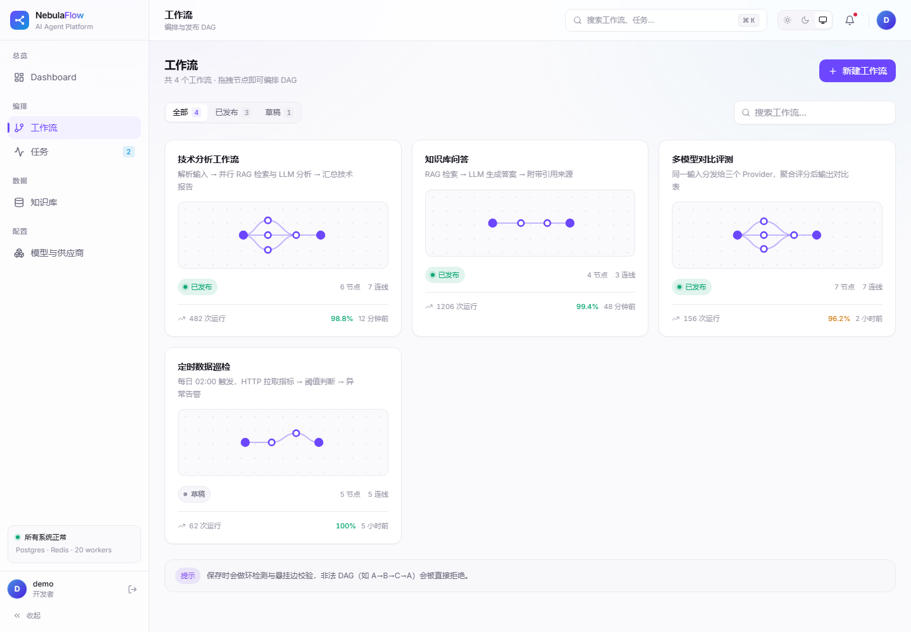
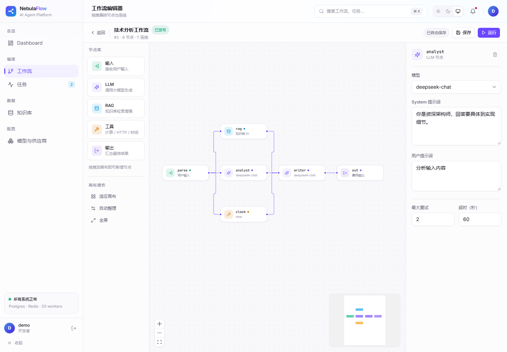
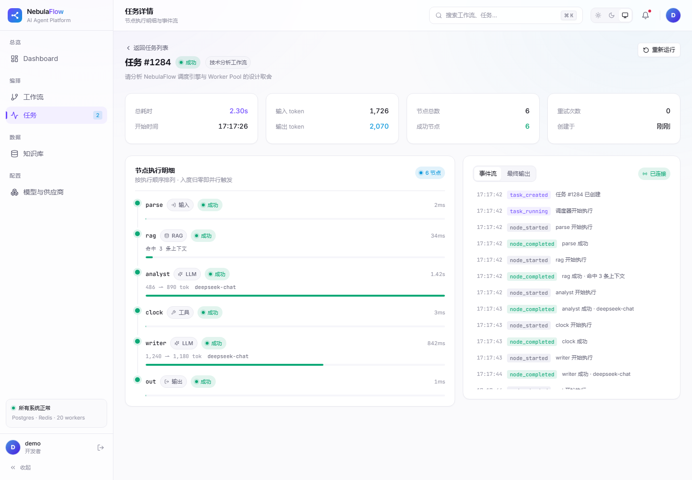
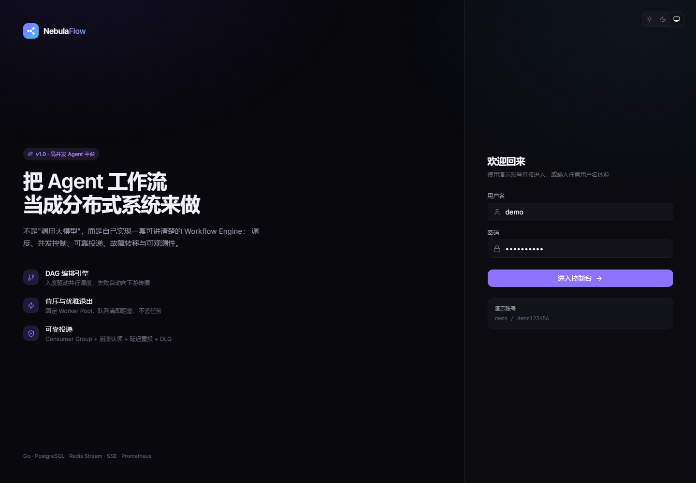

# NebulaFlow Web Framework (`web-next`)

独立的前端框架与设计系统，为 NebulaFlow 控制台提供现代化的视觉基座。
**双主题可切换**（浅色 / 深色 / 跟随系统），零后端依赖即可完整预览。

---

## 预览

| Dashboard（浅色） | Dashboard（深色） |
|---|---|
|  |  |

| 工作流编排 | DAG 编辑器 |
|---|---|
|  |  |

| 任务详情 | 登录页（深色） |
|---|---|
|  |  |

> 截图由 Edge headless 在 1440×1000 视口下实拍，非设计稿。

---

## 设计取向

| 维度 | 选择 | 理由 |
|---|---|---|
| 主色 | 紫罗兰 `#6C47FF` / `#8D71FF` | 避开"企业蓝"的既视感，更清新、更少撞色 |
| 层次 | 边框 + 极浅阴影 | 比重投影更轻，是"现代"与"老气"的主要分野 |
| 圆角 | 10 / 14 / 18px | 偏大圆角带来松弛感 |
| 留白 | 卡片 20px、区块 24px | 避免密集拥挤 |
| 字体 | Inter + JetBrains Mono | UI 用无衬线，仅代码/数字用等宽（旧版全站等宽，偏工程味） |
| 环境光 | 极淡双色径向渐变 | "清新"观感的主要来源，不抢内容 |
| 动效 | 150–400ms，`cubic-bezier(0.32,0.72,0,1)` | 干脆、有回弹感，不拖沓 |

---

## 主题系统

核心是**语义化 token**：组件只写 `bg-surface` / `text-fg-muted` / `border-line`，
从不写死具体颜色。因此换主题只需要换一组 CSS 变量，组件零改动。

```
src/index.css
  :root  { --c-bg: 250 250 252;  --c-surface: 255 255 255;  --c-brand: 108 71 255; ... }
  .dark  { --c-bg:   9   9  13;  --c-surface:  17  17  23;  --c-brand: 141 113 255; ... }

tailwind.config.js
  colors: {
    bg:      "rgb(var(--c-bg) / <alpha-value>)",
    surface: "rgb(var(--c-surface) / <alpha-value>)",
    brand:   "rgb(var(--c-brand) / <alpha-value>)",
    ...
  }
```

写成 `rgb(var(--x) / <alpha-value>)` 而不是直接 `var(--x)`，
是为了让 `bg-brand/12`、`ring-brand/35` 这类透明度修饰符继续可用。

### 变量清单

| 分组 | 变量 |
|---|---|
| 背景层次 | `--c-bg` `--c-surface` `--c-surface-2` `--c-surface-3` |
| 描边 | `--c-line` `--c-line-strong` |
| 前景 | `--c-fg` `--c-fg-muted` `--c-fg-subtle` |
| 主色 | `--c-brand` `--c-brand-fg` `--c-brand-soft` `--c-brand-ring` |
| 辅助色 | `--c-mint` `--c-sky` `--c-amber` `--c-rose` `--c-violet` |
| 阴影 | `--sh-xs` `--sh-sm` `--sh-md` `--sh-lg` `--sh-glow` |
| 环境光 | `--ambient-1` `--ambient-2` `--ambient-strength` |

### 切换与防闪烁

`index.html` 内联脚本在**首帧之前**就根据 `localStorage` / 系统偏好设置 `<html>.dark`，
避免浅色用户看到一瞬深色底、深色用户看到白闪。

运行时状态在 `src/lib/theme.ts`（Zustand），支持 `light | dark | system` 三态，
`system` 模式下监听 `prefers-color-scheme` 变化实时跟随。

---

## 目录结构

```
web-next/
├── index.html                 # 含防主题闪烁内联脚本
├── tailwind.config.js         # 语义色 → CSS 变量映射
├── vite.config.ts             # 端口 5174，/api 代理到 8080
└── src/
    ├── index.css              # ★ 设计系统：token + 组件层 + 工具类
    ├── App.tsx                # 路由表
    ├── main.tsx
    ├── lib/
    │   ├── theme.ts           # 主题 store（light/dark/system）
    │   ├── session.ts         # 会话 store（mock 登录）
    │   ├── mock.ts            # 演示数据（接真实接口时整体替换）
    │   └── utils.ts           # cn / 时间 / 时长格式化
    ├── components/
    │   ├── ui/                # ★ 基础组件库
    │   │   ├── Button.tsx     #   Button / IconButton（5 种 variant）
    │   │   ├── Card.tsx       #   Card / CardHeader / SectionTitle
    │   │   ├── Badge.tsx      #   Badge / StatusDot / StatusBadge / statusMeta
    │   │   ├── Field.tsx      #   Field / Input / Textarea / Select
    │   │   ├── Charts.tsx     #   Sparkline / AreaChart / RingProgress / BarSeries
    │   │   ├── Feedback.tsx   #   EmptyState / Progress / Skeleton
    │   │   ├── Segmented.tsx  #   分段控件
    │   │   ├── Avatar.tsx     #   确定性渐变头像
    │   │   ├── Stat.tsx       #   Stat / MiniStat
    │   │   └── index.ts       #   统一出口
    │   └── shell/
    │       ├── AppShell.tsx   # 外壳：侧边栏 + 顶栏 + 内容区
    │       ├── Sidebar.tsx    # 可折叠侧边栏（分组导航 + 激活指示条）
    │       ├── Topbar.tsx     # 玻璃拟态顶栏（搜索 / 主题 / 通知）
    │       ├── ThemeToggle.tsx
    │       └── Brand.tsx      # 品牌标记（DAG 扇出字形）
    └── pages/
        ├── Login.tsx          # 分栏登录页（品牌区 + 表单）
        ├── Dashboard.tsx      # KPI + 趋势图 + Worker 槽位 + 活动流
        ├── Workflows.tsx      # 卡片网格 + 迷你 DAG 缩略图
        ├── WorkflowEditor.tsx # ★ 画布 + 节点库 + 属性检查器
        ├── Tasks.tsx          # 任务表格
        ├── TaskDetail.tsx     # 节点时间线 + 事件流 + 输出
        ├── Knowledge.tsx      # 文档列表 + 上传区 + 检索打分
        └── Models.tsx         # Provider 卡片 + 故障转移链路
```

---

## 组件速查

```tsx
import { Button, Card, CardHeader, Badge, StatusBadge, Stat,
         AreaChart, RingProgress, BarSeries, Sparkline,
         Field, Input, Select, Textarea, Segmented,
         EmptyState, Progress, Skeleton, Avatar, MiniStat } from "@/components/ui";
```

### 状态配色是统一的

`StatusBadge` 内部维护一张**领域状态 → 视觉语义**映射表，
保证同一个 `succeeded` 在 Dashboard、任务列表、详情页都是同一种绿：

| 状态 | 语义 | 色 |
|---|---|---|
| `succeeded` `published` `indexed` `enabled` | 正常 | mint |
| `running` `indexing` | 进行中（呼吸动画） | sky |
| `pending` `queued` `draft` `cancelled` `skipped` | 中性 | 灰 |
| `failed` `unhealthy` | 异常 | rose |
| `degraded` | 警告 | amber |

新增状态只需在 `Badge.tsx` 的 `STATUS` 表里加一行。

### 图表不依赖第三方库

`Charts.tsx` 里的四个图表全部是手写 SVG：
- 平滑曲线用**水平控制点的三次贝塞尔**（避免样条过冲）
- `preserveAspectRatio="none"` 拉伸时用 `vector-effect="non-scaling-stroke"` 保证线宽不变形
- 悬停气泡用 HTML 定位而非 SVG `<text>`，避免非等比缩放下文字变形

---

## 运行

```bash
cd web-next
npm install
npm run dev        # http://localhost:5174
```

`/api` 与 `/metrics` 已代理到 `http://localhost:8080`，
所以后端起来时可直接联调（后端支持 `STORAGE_MODE=memory` 零依赖启动）。

```bash
npm run build      # 产出 dist/
```

---

## 视觉验证（无头浏览器）

Windows 下没有 agent-browser，可以用本机 Edge 的 headless 模式截图与测量，
全程不开窗口。本次搭建就是靠它做视觉校对。

**截图** —— `--force-dark-mode` 会让 `prefers-color-scheme: dark` 命中，
从而自动切到深色主题，不必改代码：

```bash
EDGE="/c/Program Files (x86)/Microsoft/Edge/Application/msedge.exe"
"$EDGE" --headless=new --disable-gpu --hide-scrollbars \
  --user-data-dir="$TEMP/edge-shot" --screenshot=out.png \
  --window-size=1440,1000 --virtual-time-budget=9000 \
  "http://127.0.0.1:5174/"
```

**精确测量** —— 截图肉眼看坐标很容易错（本次就误判过一次列宽），
要数值时走 CDP：先起一个带调试端口的实例，

```bash
"$EDGE" --headless=new --remote-debugging-port=9222 --user-data-dir="$TEMP/edge-cdp" about:blank
```

再用 Node（22+ 自带全局 `WebSocket`）连 `http://127.0.0.1:9222/json`，
发 `Emulation.setDeviceMetricsOverride` 固定视口，再 `Runtime.evaluate` 取回测量结果。
本次靠它确认了三件事：

- 表格各列的真实像素宽度（避免"看起来有空白"这类误判）；
- 所有 8 条路由 `scrollWidth === clientWidth`，无横向溢出；
- 主题切换后 `--c-bg` 确实在 `250 250 252 ↔ 9 9 13` 之间切换，且写入 `localStorage`。

> 坑：headless 下 `--window-size` 不可靠（实测拿到 500px 视口），
> 视口必须用 `Emulation.setDeviceMetricsOverride` 设。

---

## 接入真实后端

框架当前用 `src/lib/mock.ts` 的演示数据，页面只消费类型、不关心来源。
接入步骤：

1. **建 API 客户端**：在 `src/lib/` 下加 `api.ts`，封装 fetch + 注入 `Authorization`。
2. **替换数据源**：把页面里的 `TASKS` / `WORKFLOWS` 等常量换成 `useEffect` + `useState`
   或引入 TanStack Query；类型定义可直接复用 `mock.ts` 里已导出的 interface。
3. **SSE 实时流**：`TaskDetail` 的事件流当前由 `buildEvents()` 模拟，
   换成 `new EventSource('/api/tasks/:id/stream')` 并逐条 append 即可，
   事件结构已对齐后端（`task_created` / `node_started` / `node_completed` / `token`）。
4. **登录**：`src/lib/session.ts` 的 `login()` 换成调用 `/api/auth/login` 并存 token。

### 迁移到主应用

这个目录是**独立可运行**的，确认视觉满意后有两种落地方式：

- **整体替换**：把 `src/` 覆盖到 `web/src/`，保留 `web/` 的 `api/client.ts` 与 `store/auth.ts`。
- **渐进迁移**：只把 `index.css` 的设计系统 + `components/ui/` 搬过去，
  让旧页面逐步换用新的语义色类（`bg-nebula-900` → `bg-surface`）。

---

## 工作流编辑器（DAG Canvas）

`WorkflowEditor` 由 `@xyflow/react` 驱动，是一个可操作的画布而不是静态示意图：

| 能力 | 说明 |
|---|---|
| 拖拽移动节点 | React Flow 内置，位置即 `position` |
| 从节点库拖入新建 | HTML5 DnD，`screenToFlowPosition` 换算坐标，id 自动避让（`tool-2`…） |
| 拖拽手柄连线 | 左右 `Handle` 各司其职；输入节点无 target、输出节点无 source |
| **连线时环检测** | 会成环的连线直接拒绝并提示，见下 |
| 删除节点/连线 | 属性面板的删除按钮，或选中后按 `Delete` / `Backspace` |
| 属性编辑 | 右侧检查器改配置，画布上的节点摘要实时跟着变 |
| 自动整理 | 按拓扑层级分层排布（自实现，无额外依赖） |
| 缩放 / 平移 / MiniMap | 滚轮缩放、拖拽平移，右下角小地图可点可拖 |

### 环检测：把后端的约束提到前端

调度引擎建工作流时会做拓扑排序，非法 DAG（如 `A→B→C→A`）直接拒绝。
前端在**连线当下**就拦住，避免用户存下一个永远跑不起来的图：

```ts
// 从 target 出发 DFS，若能走回 source 说明成环
function createsCycle(edges, source, target) { ... }
```

实测：在 `rag → writer` 已存在时再连 `writer → rag`，连线被拒、边数不变，
并弹出「拒绝连线：writer → rag 会形成环，DAG 必须无环。」

### 两个实现要点

- **手柄样式要用 `.react-flow` 前缀提权**。React Flow 的 `style.css` 以 JS 方式
  import，注入时机晚于全局 `index.css`，同特异性下会把自定义手柄尺寸打回 6px。
  加一层 `.react-flow` 前缀把特异性提到 (0,2,0) 才稳。
- **点阵颜色用 `currentColor` 中转**。SVG attribute 不解析 `var()`，
  所以组件传 `color="currentColor"`，再由 CSS 的 `color` 提供主题变量值。

---

## 已知取舍

1. **未做认证守卫**：路由直接进入 Dashboard，方便预览。加守卫只需在 `App.tsx`
   包一层 `<RequireAuth>`（参考 `session.ts` 的 `loggedIn`）。
2. **`noUnusedLocals` 关闭**：框架骨架阶段放宽，避免演示代码因未用变量编译失败。
   正式接入时可打开。
3. **编辑器尚未回写后端**：画布上的增删改只落在本地 state，`保存` / `运行`
   按钮是占位的。接真实接口时把 `nodes`/`edges` 序列化成 workflow 的
   `nodes`/`edges` payload 提交即可（字段结构已对齐）。
4. **画布宽度有限**：1440 视口下节点库 188px + 属性面板 288px 占去两侧，
   画布约 728px，`fitView` 初始缩放约 0.82。要更大画布可收起侧栏
   （断点：节点库 `lg`、属性面板 `xl`）。
